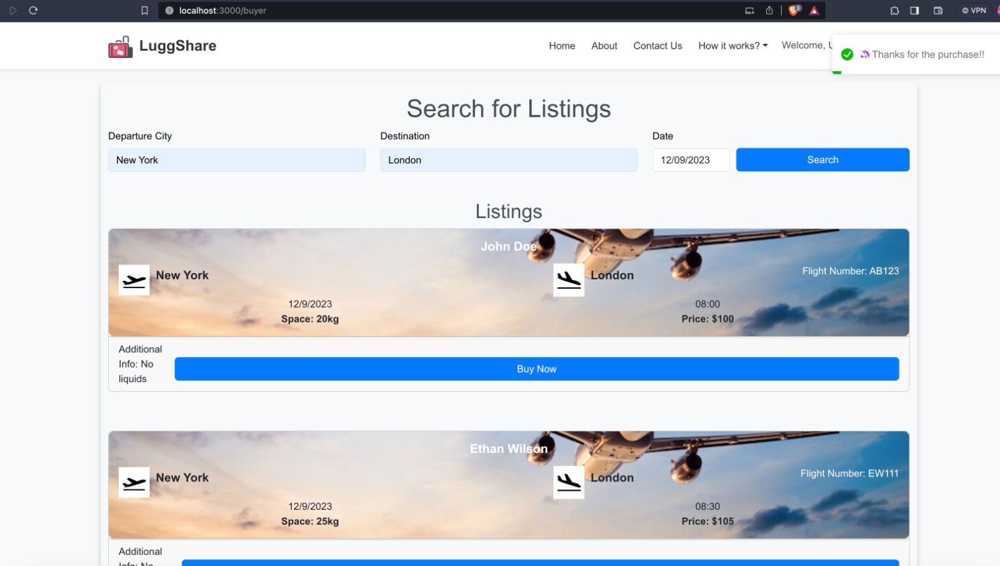
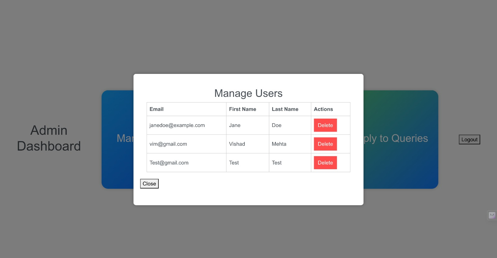
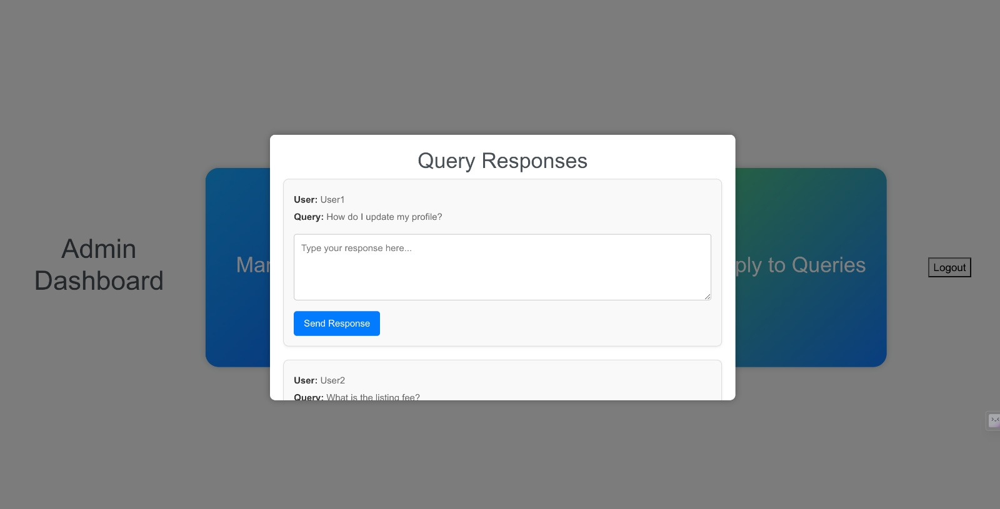

# Luggshare

## Overview
Luggshare is an innovative online portal designed to connect travelers and shippers, allowing them to make the most of their luggage space. The platform enables individuals with spare luggage space to sell this space to others who need it. By doing so, travelers can monetize their unused space, and shippers can find a cost-effective shipping alternative.

## Roles
### User
- *Sign Up & Login*: Users can create an account and log in to access their dashboard. The sign-in process is further simplified with Google login integration.
- *Password Management*: Users have the ability to reset their password if needed, ensuring account security and user convenience.
- *Listing Creation*: After logging in, users can create listings for their available luggage space, detailing size, weight capacity, and other specifics.
- *Browse Listings*: Users can browse available listings based on departure, arrival, destination, and other criteria, making it easy to find the perfect match for their shipping needs.

### Admin
- *Separate Login*: Admins have their own login portal to access the backend of the site.
- *Dashboard*: Once logged in, the admin dashboard provides comprehensive tools to manage user accounts and listings, ensuring the smooth operation of the platform.

## Technology Stack
Luggshare is built using the robust MERN stack, providing a full-stack JavaScript solution that includes:

- *MongoDB*: Our database of choice, with three primary models:
  - *User*: Storing user login details, profiles, and preferences.
  - *Listings*: Capturing all posted luggage space offerings.
  - *Orders*: Recording confirmed and paid orders.
- *Express*: The backend framework that simplifies the creation of RESTful API endpoints.
- *React*: A powerful library for building the frontend, React enables us to create a dynamic and interactive user interface.
- *Node.js*: Serving as the runtime environment for our backend, Node.js allows us to build a fast and scalable server-side application.

### Key Dependencies
- @react-spring/parallax and @react-spring/web: Libraries for creating spring-physics based animations, contributing to a fluid and interactive UI.
- @stripe/react-stripe-js and @stripe/stripe-js: Facilitate secure payment transactions within the app.
- axios: Promise-based HTTP client for making asynchronous requests to the backend.
- formik and yup: Tools for handling form states and validation, enhancing the user experience during sign-up and listing creation.
- react-bootstrap and react-bootstrap-icons: UI frameworks that provide pre-styled components and icons, used to maintain a consistent look and feel.
- react-router-dom: Manages navigation and routing in our React application.
- react-toastify: Delivers beautiful, non-blocking notifications to inform users of processes or interactions.
- mongoose: ODM library for MongoDB and Node.js, simplifying database interactions.
- bcrypt and bcryptjs: Libraries for hashing and securing user passwords.
- razorpay and stripe: Integrated for processing payments securely and efficiently.
- uuid: Generates unique identifiers, useful for order processing and tracking.

## Interactive UI
Luggshare boasts a user-friendly and aesthetically pleasing interface. Through thoughtful design, users enjoy a seamless experience whether they are browsing listings, creating their own, or managing their profiles. Our use of modern animations and responsive design ensures that Luggshare is not only functional but also engaging and accessible across all devices.

---

Luggshare - Your space, their journey.

# Getting Started with Create React App

This project was bootstrapped with [Create React App](https://github.com/facebook/create-react-app).

## Available Scripts

In the project directory, you can run:

### npm start

Runs the app in the development mode.\
Open [http://localhost:3000](http://localhost:3000) to view it in your browser.

The page will reload when you make changes.\
You may also see any lint errors in the console.

### npm test

Launches the test runner in the interactive watch mode.\
See the section about [running tests](https://facebook.github.io/create-react-app/docs/running-tests) for more information.

### npm run build

Builds the app for production to the build folder.\
It correctly bundles React in production mode and optimizes the build for the best performance.

The build is minified and the filenames include the hashes.\
Your app is ready to be deployed!

See the section about [deployment](https://facebook.github.io/create-react-app/docs/deployment) for more information.

### npm run eject

*Note: this is a one-way operation. Once you eject, you can't go back!*

If you aren't satisfied with the build tool and configuration choices, you can eject at any time. This command will remove the single build dependency from your project.

Instead, it will copy all the configuration files and the transitive dependencies (webpack, Babel, ESLint, etc) right into your project so you have full control over them. All of the commands except eject will still work, but they will point to the copied scripts so you can tweak them. At this point you're on your own.

You don't have to ever use eject. The curated feature set is suitable for small and middle deployments, and you shouldn't feel obligated to use this feature. However we understand that this tool wouldn't be useful if you couldn't customize it when you are ready for it.

## Learn More

You can learn more in the [Create React App documentation](https://facebook.github.io/create-react-app/docs/getting-started).

To learn React, check out the [React documentation](https://reactjs.org/).

### Code Splitting

This section has moved here: [https://facebook.github.io/create-react-app/docs/code-splitting](https://facebook.github.io/create-react-app/docs/code-splitting)

### Analyzing the Bundle Size

This section has moved here: [https://facebook.github.io/create-react-app/docs/analyzing-the-bundle-size](https://facebook.github.io/create-react-app/docs/analyzing-the-bundle-size)

### Making a Progressive Web App

This section has moved here: [https://facebook.github.io/create-react-app/docs/making-a-progressive-web-app](https://facebook.github.io/create-react-app/docs/making-a-progressive-web-app)

### Advanced Configuration

This section has moved here: [https://facebook.github.io/create-react-app/docs/advanced-configuration](https://facebook.github.io/create-react-app/docs/advanced-configuration)

### Deployment

This section has moved here: [https://facebook.github.io/create-react-app/docs/deployment](https://facebook.github.io/create-react-app/docs/deployment)

### npm run build fails to minify

This section has moved here: [https://facebook.github.io/create-react-app/docs/troubleshooting#npm-run-build-fails-to-minify](https://facebook.github.io/create-react-app/docs/troubleshooting#npm-run-build-fails-to-minify)